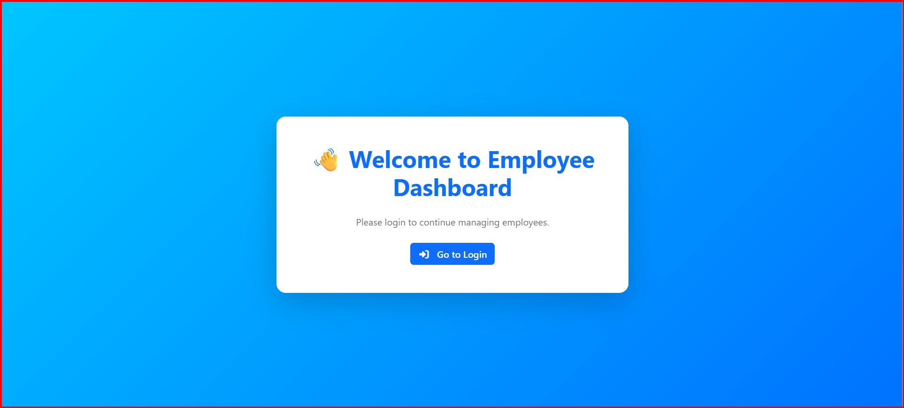
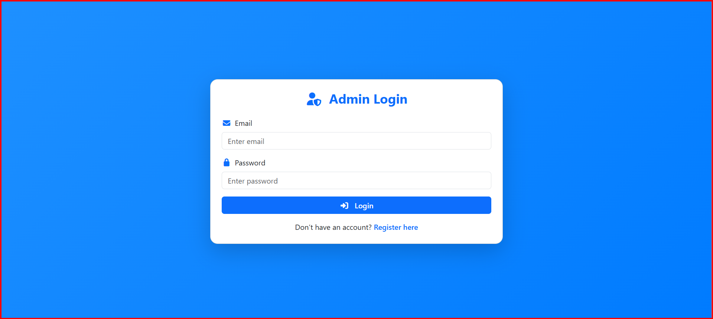
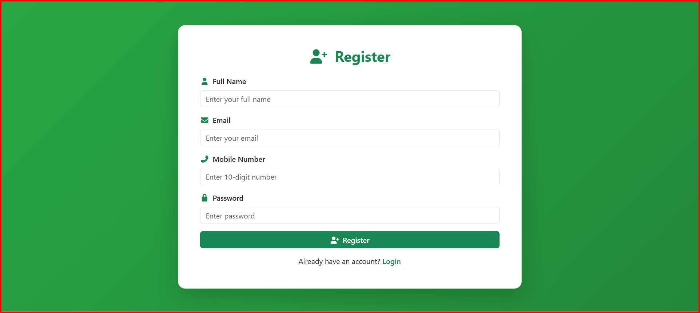
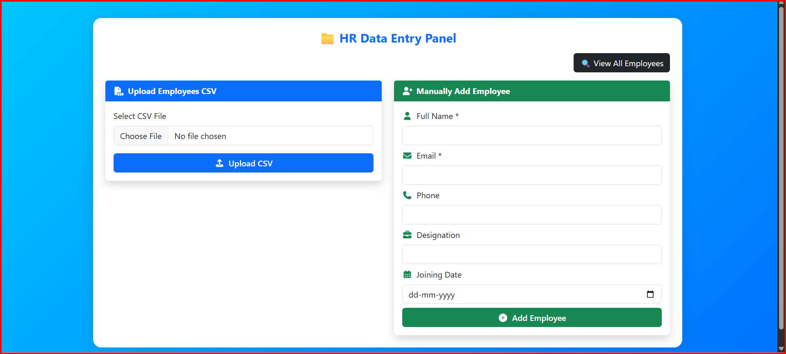
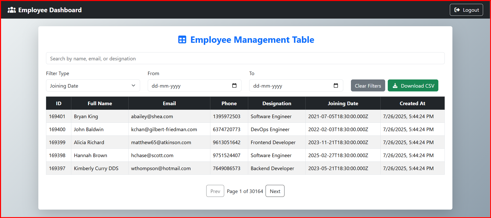

# Employee Management Dashboard

## 📌 Project Overview
This project is a **full-stack Employee Management Dashboard** developed as part of a technical evaluation to assess backend and frontend development skills, including authentication, data handling, and file processing.

##  Features
### 🔐 Authentication
- User login and registration
- Secure session management using **JWT tokens**

### 👤 Employee Management
- Add employee records manually through a form
- Bulk upload employee data using Excel (.xlsx) or CSV (.csv)
- Store all employee records in **MongoDB** via Node.js backend

### 📊 Frontend Interface
- Display employee data in a responsive table
- Date-based filtering (Created Date / Joining Date/searching name/emai/degingention)
- Download filtered data as Excel or CSV

## 🛠️ Tech Stack
- **Frontend:** React.js, Bootstrap  
- **Backend:** Node.js, Express.js  
- **Database:** Mysql 
- **Authentication:** JWT  

## ⚙️ How to Run Locally
1. **Clone the repository**
2. ```bash
git clone https://github.com/<your-username>/Employee-Management-Dashboard.git
## Install dependencies for frontend
cd frontend
npm install
npm i bootstrap@5.3.7
npm install @fortawesome/fontawesome-free animate.css axios bootstrap file-saver framer-motion react react-bootstrap react-csv react-dom react-router-dom xlsx
## Start frontend
npm run dev
## Install dependencies for backend
cd backend
npm install
## Start backend
nodemon indesx.js
node index.js
## 📸 Screenshots
### Home Page


### Login Page


### Registration Page 


### Data Entry


### Dashboard



